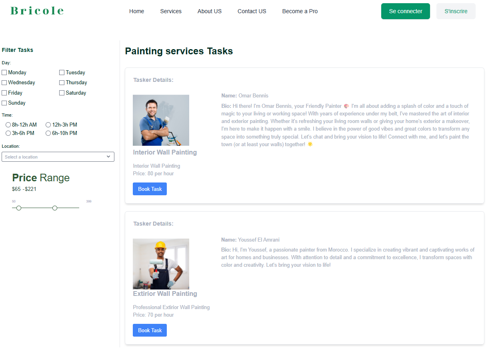
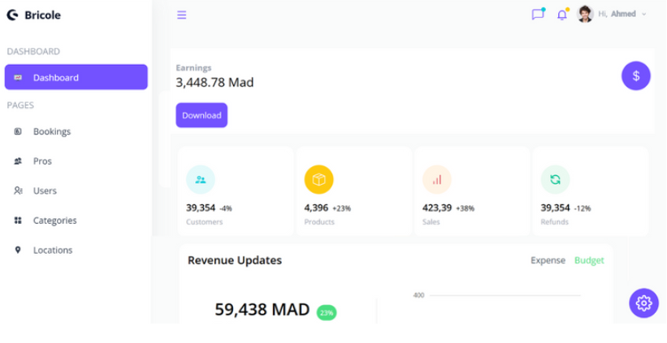

# 🛠️ Bricole 🌟

Bricole is a versatile online platform designed to connect users with local service providers. Whether users are seeking essential tasks like house cleaning, plumbing, or specialized services such as painting and electrical work, Bricole offers a streamlined experience. With intuitive search functionalities and robust user profiles, individuals can easily find and connect with skilled professionals in their area. Bricole ensures efficiency through multi-validation filters, allowing users to refine their search based on service category, location, and specific project requirements. This platform also facilitates secure communication and seamless transaction processing, ensuring a reliable and convenient service experience for both users and service providers alike.

## Technologies Used 🛠️

- **MongoDB:** A flexible NoSQL database that stores data in BSON documents. Ideal for applications requiring horizontal scalability and semi-structured data manipulation.
- **Node.js:** A server-side JavaScript runtime environment ensuring total consistency between frontend and backend development. Its asynchronous, non-blocking nature makes it perfect for real-time web applications.
- **React:** A JavaScript library for creating interactive user interfaces. It adopts a declarative approach with reusable components and utilizes the virtual DOM to optimize performance.
- **Tailwind CSS:** A utility-first CSS framework that provides low-level utility classes to build custom designs quickly. It promotes simplicity and consistency across projects.

## Features ⚙️

- **NoSQL Database Flexibility:** Utilizes MongoDB for efficient data storage and scalability.
- **Server-Side JavaScript:** Node.js ensures smooth and cohesive development across the stack.
- **Interactive UI Components:** React is employed to build dynamic and responsive user interfaces.
- **Responsive Design: Ensures compatibility across various devices and screen sizes.
- **Role-Based Access Control: Different functionalities available for users, pros, and admins.

## Usage 🎯

- **User:** Sign up or log in to browse and manage your projects.
- **Pro:** Access additional features and tools for advanced project management.
- **Admin:** Access the admin dashboard to manage users and data.

## Screenshots 📷

### Home Page

### Become a Pro Page

### Login Page

### Tasks Page

### Admin Dashboard

